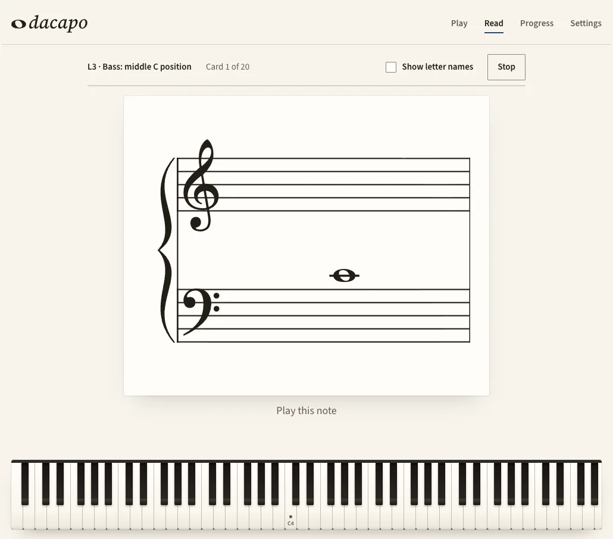
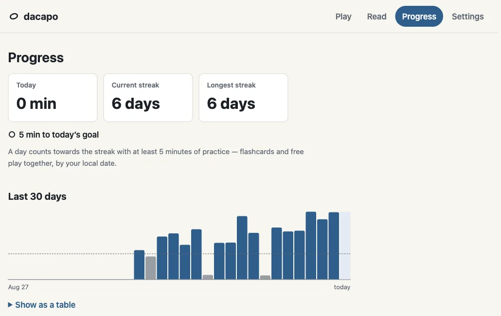
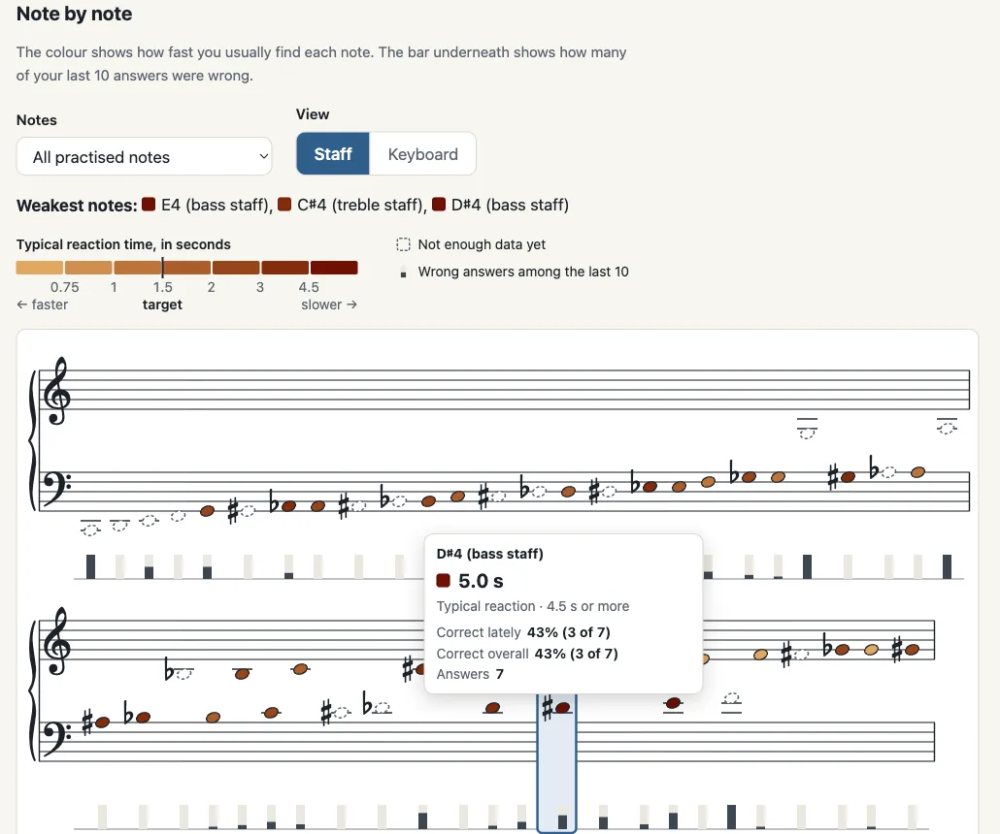
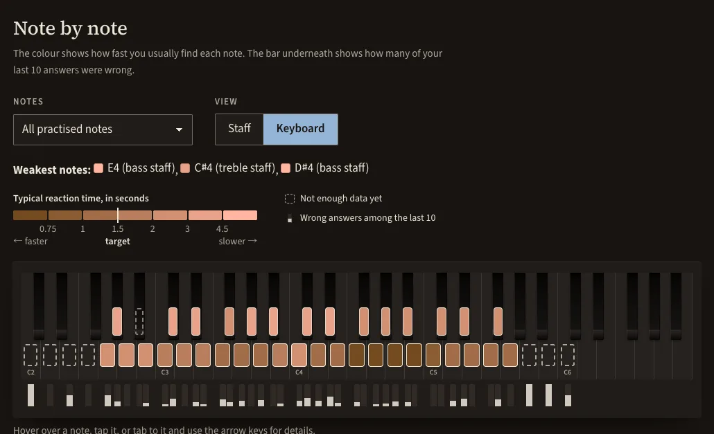

# dacapo

_Da capo_ — "from the beginning."

An open-source web app for learning the piano with a MIDI keyboard: sight-reading drills
on a real grand staff, reaction-time tracking, a per-note weakness heatmap, and a practice log.
All data stays in your browser.

**Status:** the MVP (version 0.1.0) is complete: all five milestones of
[docs/MVP.md](docs/MVP.md) are built and tested. It has not been used day to day for long yet,
so expect rough edges; bug reports are welcome. See [CHANGELOG.md](CHANGELOG.md) for what is in
each release. Practising pieces ([docs/PIECES.md](docs/PIECES.md)) is under way: the library,
import, wait mode, MIDI playback, practice records with a measure heatmap and a rhythm mode with a
metronome are in.



## Why

The first real wall for a self-taught pianist is reading: seeing a note on the grand staff
and finding the key without counting lines. dacapo drills exactly that on real notation
(no falling notes), measures every answer — right or wrong, and how fast — and keeps
practising the notes you are slowest at. Progress is visible day by day, and the app works
in English and Simplified Chinese.

## Features

- **Live keyboard.** An 88-key on-screen piano lights up as you play, with velocity, the sustain
  pedal and the notes you just played. Works with a MIDI keyboard, your computer keyboard or
  the mouse / touch.
- **Sight-reading flashcards.** One note at a time on a real grand staff, in seven levels from
  middle C position to ledger lines and sharps and flats. You press the key in the right
  octave; every answer records whether it was right and how fast. The next card favours the
  notes you are slow or unsure on.
- **Practice log.** Flashcard sessions and free play are saved: minutes today, a daily streak
  (5 minutes a day), a 30-day chart and the list of sessions.
- **Weakness heatmap.** Every note you have practised, on the grand staff or on the keyboard,
  coloured by how fast you usually find it and marked with how often you missed it lately,
  with the three weakest notes named and a table view.
- **Pieces, in wait mode and in rhythm.** Six public-domain pieces from Initial to about grade 5, plus your
  own MusicXML (`.musicxml`, `.xml` or `.mxl`, for example from MuseScore). The cursor waits on
  the real score until you have played the right keys. You can practise one hand or both, loop a
  few bars, start anywhere, and play or skip the repeats. With the keyboard connected over USB,
  the instrument can play the passage to you at any tempo, or play the other hand as you go.
  In rhythm mode a metronome counts you in and the score moves in time: every note is timed, and
  afterwards you see how many came in time, whether you tend to play early or late, and where you
  sped up or slowed down. "Weak bars" tints each bar by how long you hesitated there, or how far
  off the beat you were, in your last runs, and one click loops the weakest ones.
- **Your data stays yours.** Everything is stored in your browser (IndexedDB). Export it as a
  JSON file and import it on another computer.
- English and Simplified Chinese, light and dark themes. Everything works from the keyboard,
  and charts have a table view and labels for screen readers.







The screenshots use generated practice data.

## Requirements

- **Browser:** Chrome or Edge on desktop. They support
  [Web MIDI](https://developer.mozilla.org/docs/Web/API/Web_MIDI_API), which dacapo uses to
  read your keyboard. Other browsers can still use the fallback input.
- **MIDI keyboard:** recommended, but optional. You can also play with your computer
  keyboard or by clicking the on-screen piano.
- No account, no server. Everything is stored locally in your browser; Settings can export it
  as a JSON file for a backup or to move to another computer.

## Development

You need [Node.js](https://nodejs.org/) 22.13 or newer (the CI uses the version in `.nvmrc`)
and [pnpm](https://pnpm.io/). The pnpm version is pinned in `packageManager` in `package.json`;
install that version with `npm install -g pnpm@10.34.5`, or let
[Corepack](https://nodejs.org/api/corepack.html) pick it up if you have it enabled.

```sh
pnpm install
pnpm dev
```

Then open the URL Vite prints (usually http://localhost:5173).

### Scripts

| Script              | What it does                                           |
| ------------------- | ------------------------------------------------------ |
| `pnpm dev`          | Start the dev server with hot reload                   |
| `pnpm build`        | Type-check and build for production into `dist/`       |
| `pnpm preview`      | Serve the production build locally                     |
| `pnpm typecheck`    | Run the TypeScript compiler without emitting           |
| `pnpm lint`         | Run ESLint                                             |
| `pnpm format`       | Format all files with Prettier                         |
| `pnpm format:check` | Check formatting without writing                       |
| `pnpm test`         | Run the unit tests once with Vitest                    |
| `pnpm check`        | Typecheck, lint, test and build — run this before a PR |

The app uses hash-based routes (`/#/read`), so the `dist/` folder can be served by any
static file host without rewrite rules.

## Roadmap (after the MVP)

These are deliberately out of scope for the MVP and are the candidates once it is used daily:

- Audio output (the app makes no sound of its own apart from the metronome click — the piano
  plays the notes, also for demos over MIDI)
- Analysis of scale evenness
- Theory and ear training
- Accounts and sync between devices
- AI coaching

## Contributing

See [CONTRIBUTING.md](CONTRIBUTING.md).

## License

[MIT](LICENSE)

Notation is drawn with [VexFlow](https://github.com/vexflow/vexflow) (MIT) and the
[Bravura](https://github.com/steinbergmedia/bravura) music font (SIL Open Font License 1.1) on the
Read page, and with [Verovio](https://www.verovio.org) (LGPL-3.0-or-later, shipped unmodified as
separate files) on the Pieces pages. Some built-in pieces are CC0 encodings from the
[PDMX](https://zenodo.org/records/15571083) dataset (CC BY 4.0). Everything is part of the build,
so the app never loads anything from a CDN. See [THIRD_PARTY_NOTICES.md](THIRD_PARTY_NOTICES.md)
for every licence and source.
