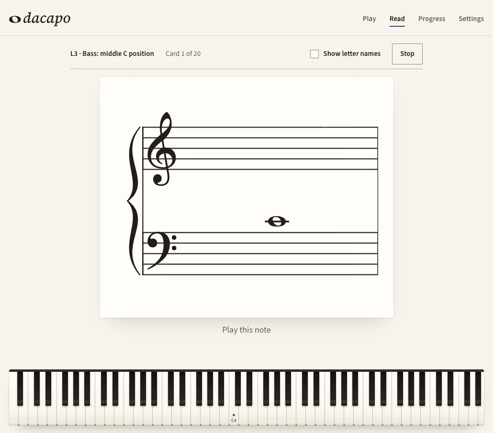
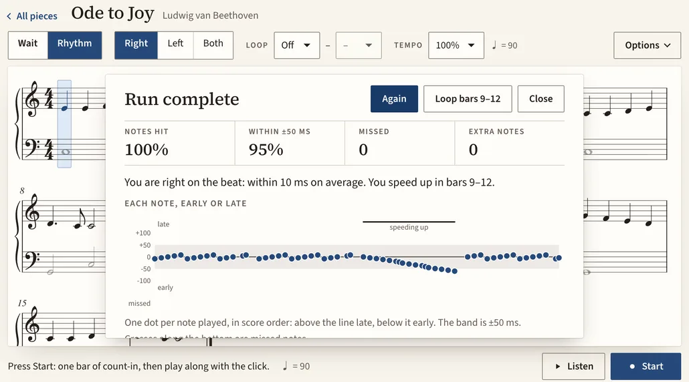
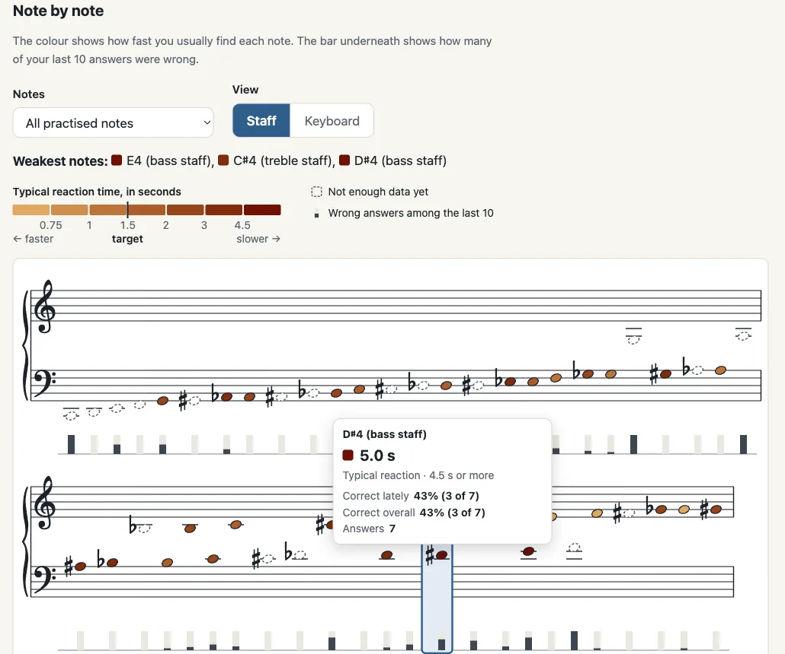
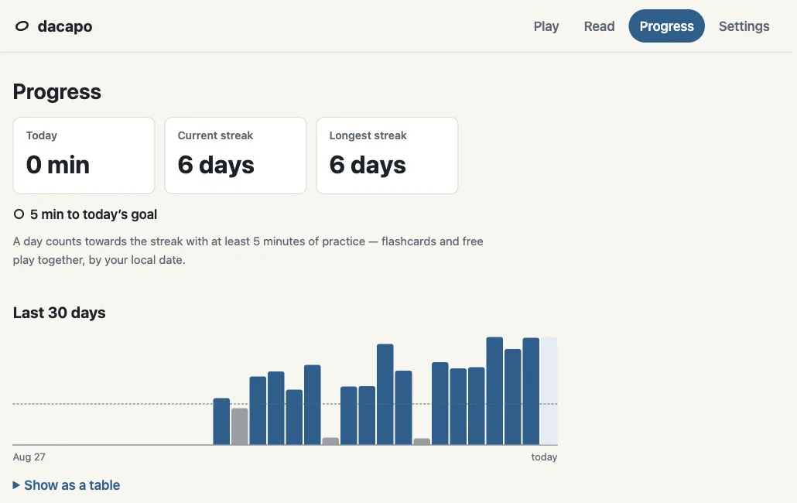
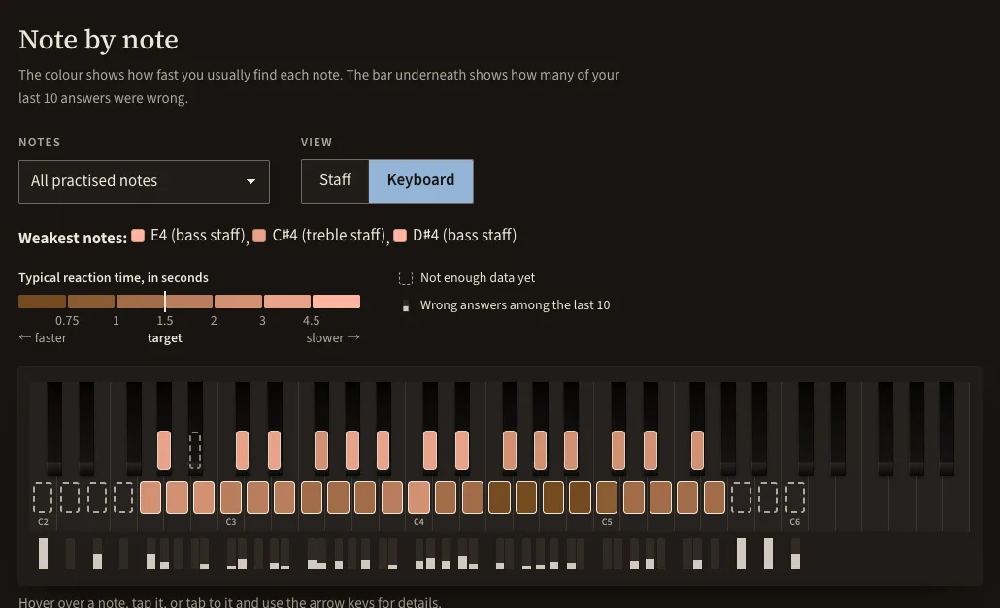
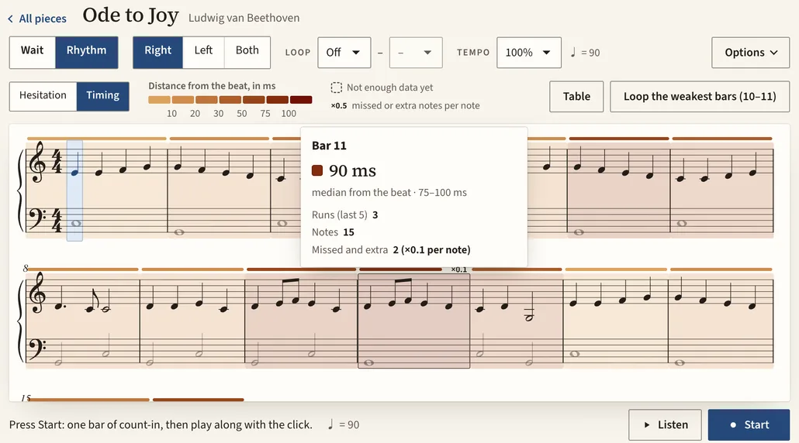

# dacapo

[简体中文](README.zh-CN.md) · [繁體中文](README.zh-TW.md) · [日本語](README.ja.md) ·
[한국어](README.ko.md)

[](https://github.com/ya-luotao/dacapo/actions/workflows/ci.yml)
[](LICENSE)
[](https://playdacapo.com/)

_Da capo_ — "from the beginning."

An open-source web app for learning the piano with a MIDI keyboard: sight-reading drills
on a real grand staff, reaction-time tracking, a per-note weakness heatmap, real pieces in wait
and rhythm mode, scales measured note by note for evenness, and a practice log. All data stays in
your browser, unless you sign in to sync it between your own devices.

**Try it:** [playdacapo.com](https://playdacapo.com/) — in Chrome or Edge
on a computer, with a MIDI keyboard over USB, or with your computer keyboard. Nothing to install,
and no account needed.

<p>
  
  
  
</p>

**Status:** the MVP (version 0.1.0) is complete: all five milestones of
[docs/MVP.md](docs/MVP.md) are built and tested. It has not been used day to day for long yet,
so expect rough edges; bug reports are welcome. See [CHANGELOG.md](CHANGELOG.md) for what is in
each release. Practising pieces ([docs/PIECES.md](docs/PIECES.md)) is built too, not yet in a
release: the library, MusicXML import, wait mode, MIDI playback, practice records with a measure
heatmap, a rhythm mode with a metronome and timing analysis, a metronome of its own for any
practice, and a built-in piano for keyboards without a sound of their own. So are scales
([docs/SCALES.md](docs/SCALES.md)) with an analysis of how even they are, a focus mode for
practising, and an optional account that syncs your practice between your devices
([docs/SYNC.md](docs/SYNC.md)); the Apple app gets it in its next release, with its privacy
details updated.

## Why

The first real wall for a self-taught pianist is reading: seeing a note on the grand staff
and finding the key without counting lines. dacapo drills exactly that on real notation
(no falling notes), measures every answer — right or wrong, and how fast — and keeps
practising the notes you are slowest at. Progress is visible day by day.

## Features

- **The basics.** Fifteen short lessons for complete beginners, in English, Simplified Chinese and
  Traditional Chinese:
  the keyboard, the staff and clefs, landmark notes and intervals, rhythm, sharps and flats, the
  major scale and key signatures, posture and fingering, dots, ties, triplets and syncopation,
  minor keys, dynamics and articulation, the pedals, ornaments, chords and harmony, how to
  practise, and styles and forms, each with figures to play with on your own keyboard and
  exercises to finish. A lesson ends with a way straight into the practice it prepares (the right
  level, scale or piece), each practice names its lesson to a newcomer, and a finished lesson is
  ticked on every device you sign in on ([docs/LEARN.md](docs/LEARN.md)).
- **Live keyboard.** An 88-key on-screen piano lights up as you play, with velocity, the sustain
  pedal and the notes you just played. Works with a MIDI keyboard, your computer keyboard or
  the mouse / touch.
- **Sight-reading flashcards.** One note at a time on a real grand staff, in seven levels from
  middle C position to ledger lines and sharps and flats. You press the key in the right
  octave; every answer records whether it was right and how fast. The next card favours the
  notes you are slow or unsure on. Read also has **theory cards**: name the interval between two
  written notes (up to double sharps and flats), play the tonic of a key signature, and play or
  name a chord as written, each in levels of its own ([docs/EAR.md](docs/EAR.md)). And
  **rhythm**: a line of rhythm on a one-line staff, tapped on any key after a bar of count-in,
  every note timed against the click; ten levels from quarter notes through ties, sixteenths,
  triplets, syncopation and 6/8 to two hands in two rhythms ([docs/READING.md](docs/READING.md)).
  And **sight-reading**: short music never seen before, generated on the grand staff in eight
  levels from the right hand in C position to chords in the left hand in keys of four sharps or
  flats; look at it for a few seconds, then play it through once in time (or note by note, for a
  first look), the bars covered as you play them if you want to read ahead, and see every bar
  judged.
- **Ear training.** Intervals and chords by ear, in twelve levels from the octave, fifth and
  major third to compound intervals, inversions and seventh chords. Your instrument or the
  built-in piano plays the question; play it back on the keys (the first note or the root is
  marked) or name it. The next question favours what you miss, and every answer is kept. **Echo**
  plays a short melody after the chord of its key, in seven levels from three notes by step to
  minor keys and chromatic notes; play it back note by note, and a wrong note shows the melody on
  the staff with yours over it. **Rhythm** plays a bar after a bar of clicks, in Rhythm's eight
  one-line levels: tap it back in time, or choose it among bars written out that differ from it in
  one cell ([docs/READING.md](docs/READING.md)). **Tunes** plays the melodies of the library's
  eight lead sheets phrase by phrase, each after the chord of its key and in its own rhythm: play
  the phrase back, then the whole tune, in its key or in another one drawn for you, which is
  transposing by ear; a wrong note shows the phrase on the staff with yours beside it
  ([docs/HARMONY.md](docs/HARMONY.md)). On the Progress page each kind of question, by ear or on the
  staff, shows its levels, its weakest items and a table of what you answer instead (“minor 6th
  answered as perfect 5th: 4 of 12”) ([docs/EAR.md](docs/EAR.md)).
- **Harmony: chords from symbols.** A chord symbol as a lead sheet prints it (`Am`, `G7`,
  `F/A`, `Dm7♭5`); play its notes in any octave and voicing, a slash chord's bass lowest. Five
  levels from the triads of C, G and F major to every root's triads and seventh chords, slash
  chords and `°`, `+`, `sus`, `6` and `add9` chords, timed and favouring the ones you are slow on,
  with the notes shown on request. **Progressions** (`I–IV–V–I`, `ii7–V7–Imaj7`, the 12-bar
  blues and more) are written out in any key with the left hand in a pattern (block chords,
  Alberti bass, waltz, stride …) and the right hand's chords voiced to move as little as they can,
  then practised as a piece; and on the Ear page, cadences by ear: authentic, plagal, half or
  deceptive, named after four chords. **Improvise** over a backing in a loop (the 12-bar blues,
  `I–vi–IV–V`, `ii–V–I`, a modal vamp; straight or swung): the chords shown as they come, a scale
  marked on the keyboard, each note tinted as a chord tone, a scale tone or outside, call and
  response, then feedback rather than a score and the take played back with its backing
  ([docs/HARMONY.md](docs/HARMONY.md)).
- **A first visit.** Start asks where you start from (new to the piano, or playing already and
  how far you read) and shows whether your keys are heard, with a note to check the sound. For
  someone who plays already every practice is open at once and Read begins where their reading
  does. Every practice page says what plays when no MIDI keyboard is connected
  ([docs/START.md](docs/START.md)).
- **Today.** Once you have practised, the home page opens on a plan for the day made from your
  own records: a scale to warm up with, the piece in hand, the next lesson and a level of the
  practice you have left alone longest, and the pieces due for review, for 10 to 45 minutes. Each
  step starts with a click and ticks itself once it is played. **Where you are**, on Progress,
  shows how far each practice has got and its next step ([docs/TODAY.md](docs/TODAY.md)).
- **Practice log.** Flashcard sessions and free play are saved: minutes today, a daily streak
  (5 minutes a day, or a goal of your own up to 45; a change never rewrites the days before
  it), a 30-day chart and the list of sessions. **Last week** says what a week came to (days,
  time, levels mastered, pieces into review, a tempo reached), with this week so far beside it,
  and Home says it in a line when a new week begins. **How you are doing** charts each
  practice week by week over half a year (reading speed, sight-reading, theory, ear, rhythm by ear,
  chord symbols, timing against the beat, scale evenness, pieces right the first time) and says in words how the last four weeks
  compare with the four before, level for level where levels differ.
- **Assignments.** A teacher (or a parent, or you) sets a week's practice as tasks: a piece with
  its bars, hands, mode and tempo, a scale with the click, a level of Read, Ear or Harmony, a
  lesson, minutes a day. It is shared as a link or a file, without a server: the assignment is in
  the link itself. Whoever opens it gets a checklist that ticks itself from what they play, each
  task with a button that starts it with its settings. At the next lesson a report goes back the
  same way: each task's figure, the best and the last run, the minutes of each day. Both can
  be printed ([docs/ASSIGNMENTS.md](docs/ASSIGNMENTS.md)).
- **Weakness heatmap.** Every note you have practised, on the grand staff or on the keyboard,
  coloured by how fast you usually find it and marked with how often you missed it lately,
  with the three weakest notes named and a table view.
- **Pieces, in wait mode and in rhythm.** Thirty-one public-domain works from Initial to about grade 5,
  ten of them first pieces with their editions’ fingering, eight of them lead sheets: a folk song, hymn or spiritual with chord symbols of our own, its left
  hand made from the symbols in a pattern you choose (block chords, Alberti bass, a waltz, stride)
  and written on the bass staff;
  plus your own MusicXML (`.musicxml`, `.xml` or `.mxl`, for example from MuseScore). The cursor waits on
  the real score until you have played the right keys. You can practise one hand or both, loop a
  few bars, start anywhere, and play or skip the repeats. Your instrument (over USB MIDI) or the
  built-in piano can play the passage to you at any tempo, or play the other hand as you go.
  In rhythm mode a metronome counts you in and the score moves in time: every note is timed, and
  afterwards you see how many came in time, whether you tend to play early or late, and where you
  sped up or slowed down. "Weak bars" tints each bar by how long you hesitated there, or how far
  off the beat you were, in your last runs, and one click loops the weakest ones. If the file has
  fingering, the keys marked on the keyboard show which finger to use. Any run can be played back
  as you played it, with the score following and wrong notes shown where they fell, and compared
  bar by bar with the score as written, or saved as a MIDI file to hear in another program or
  send to a teacher. Pieces you have played to the end come back for review
  after a day, then two, four, a week and up to two months while they go well. To learn a piece
  by heart, memory mode fades the score bar by bar, with a peek when you need one. Any piece can
  be transposed up to six semitones up or down: the score is redrawn in the new key, and
  everything plays and is judged there. After a run, one sentence says what to work on next and
  a button sets it up: one hand at a time, a few bars in a loop, a slower tempo, or the next
  rung of a tempo ladder that takes the piece up to the score's tempo ten per cent at a time.
  The library says which piece is next for you: the one you have in hand, or the first you have
  not begun at the grade you have reached. A piece's plan takes it phrase by phrase, each hand,
  then together, then in time, then the whole piece, ticks what your records show is done, and
  starts the next step with one click.
- **Scales, measured for evenness.** Major, the three minors, chromatic and the major and minor
  arpeggios in every key, one to four octaves, one hand, both, or in contrary motion from one
  tonic, drawn with Hanon's fingering. Play at your own tempo or with the
  click (♩ = 40–160, two, three or four notes to the beat, after a bar of count-in): afterwards you
  see how even the notes were in time (against the 8–9 ms of professional pianists), in loudness
  and in legato, note by note on a chart and in colour on the score, including where the thumb
  crossings come late or early, and with the click whether you sat early or late on it. A weak
  spot can be looped, a few notes either side, until you stop. The keyboard shows the finger for
  the keys to start on and, if you want, for each next key, with a word before a thumb crossing.
  Every run is kept, with a 30-day trend per scale and the scale to practise next. After a run
  one sentence says what to work on next (loop around a place, each hand alone, the click at the
  tempo you started at, or the next tempo), and its button sets it up.
- **Technique, measured the same way.** Five-finger patterns in every key, Hanon's first twenty
  exercises exactly as printed (notes, bars and his fingering, transcribed twice from the 1900
  edition and checked), the key's triad in block chords (two or three octaves) and broken chords
  (one or two), and from the same book his sevenths in arpeggios, repeated notes, the trill,
  thirds, and octaves (scales in octaves in the 24 keys), with a trill on any pair of fingers in any
  key. Chords are timed by their first key, with how far apart their keys came and whether the top
  note stood out; a trill shows its rate over time and whether its two fingers were even; repeated
  notes how long each key was up before it was struck again; in Hanon's patterns the place named
  is the same note of every group.
- **Focus mode.** While you practise a piece or a scale, the header and the settings can give way
  to the score: one slim row keeps larger or smaller notes, the keyboard on or off, the settings
  when you need them, the metronome and full screen. The screen stays on while you practise.
- **Built-in piano.** A sampled Yamaha C5 grand (the Salamander Grand Piano by Alexander Holm)
  plays demos and the other hand when your keyboard has no MIDI output, and sounds the computer
  keyboard and the on-screen keys. A MIDI keyboard without a sound of its own can play through it
  too. Its samples (about 4 MB) are loaded only once it is needed.
- **Metronome.** A Maelzel-style pendulum that swings through the centre on the beat you hear,
  with a sliding weight for the tempo; 20–300 BPM, tap tempo, time signatures, accented and muted
  beats, subdivisions, three sounds, a visual-only mode, and a tempo trainer that speeds up every
  few bars or drops bars to silence. A chip in the header starts it while you play, read or practise
  a piece (and sets it to the piece's tempo); rhythm mode pauses it for its own click.
- **Your data stays yours.** Everything is stored in your browser (IndexedDB). Export it as a
  JSON file and import it on another computer.
- **Five languages**: English, 简体中文, 繁體中文 (Taiwan), 日本語 and 한국어, each with its own
  terms for the staff and the keyboard, and its own fonts. Notes are named by letter (C4, F♯) in
  every language, or as do re mi (Do4, Fa♯) for those who choose it in Settings.
- Light and dark themes. Everything works from the keyboard, and charts have a table view and
  labels for screen readers. Chrome and Edge can install it as an app, and once it has been
  opened it opens and works without a network.







The screenshots use generated practice data.

## Requirements

- **Browser:** Chrome or Edge on desktop. They support
  [Web MIDI](https://developer.mozilla.org/docs/Web/API/Web_MIDI_API), which dacapo uses to
  read your keyboard. Other browsers can still use the fallback input.
- **MIDI keyboard:** recommended, but optional. You can also play with your computer
  keyboard or by clicking the on-screen piano.
- **Sound:** the notes of demos and of the other hand are played by your instrument over MIDI,
  or by the built-in piano from the computer when the instrument has no MIDI output. The clicks
  of rhythm mode and the metronome come from the computer too; to hear them in a digital piano's
  headphones, connect the computer's audio output to the piano's line input, and avoid Bluetooth
  headphones (their delay varies too much to calibrate).
- No account needed. Everything is stored locally in your browser; Settings can export it as a
  JSON file for a backup or to move to another computer.
- **Without a network:** once it has been opened, the web app is stored on the device and opens
  offline. The notation engine of Pieces and Scales, the built-in piano and the other languages
  are stored when they are first used, or all at once with **Store everything** in Settings
  ([docs/OFFLINE.md](docs/OFFLINE.md)).
- playdacapo.com counts visits with Cloudflare Web Analytics: no cookies and no personal data,
  and nothing about your practice. The Apple app and any other build have no analytics.
- Optionally, sign in with your email address and a code sent to it, and your practice syncs
  between your devices through dacapo's sync service
  ([privacy policy](https://playdacapo.com/privacy)). Deleting the account in Settings removes
  everything from the service. A build without `VITE_SYNC_ENDPOINT` (a fork, your own build) has
  no account at all ([docs/SYNC.md](docs/SYNC.md)).
- Signed in, you can also publish a profile page with your year of practice, like a GitHub
  profile: the grid only, or with what you practised each day. It is off until you turn it on
  ([docs/PROFILE.md](docs/PROFILE.md)).

## Development

You need [Node.js](https://nodejs.org/) 22.13 or newer (the CI uses the version in `.nvmrc`)
and [pnpm](https://pnpm.io/). The pnpm version is pinned in `packageManager` in `package.json`;
install that version with `npm install -g pnpm@10.34.5`, or let
[Corepack](https://nodejs.org/api/corepack.html) pick it up if you have it enabled.

```sh
pnpm install
pnpm dev
```

Then open the URL Vite prints (usually http://localhost:5173).

### Scripts

| Script              | What it does                                           |
| ------------------- | ------------------------------------------------------ |
| `pnpm dev`          | Start the dev server with hot reload                   |
| `pnpm build`        | Type-check and build for production into `dist/`       |
| `pnpm preview`      | Serve the production build locally                     |
| `pnpm typecheck`    | Run the TypeScript compiler without emitting           |
| `pnpm lint`         | Run ESLint                                             |
| `pnpm format`       | Format all files with Prettier                         |
| `pnpm format:check` | Check formatting without writing                       |
| `pnpm test`         | Run the unit tests once with Vitest                    |
| `pnpm check`        | Typecheck, lint, test and build — run this before a PR |

The app uses hash-based routes (`/#/read`), so the `dist/` folder can be served by any
static file host without rewrite rules. To serve it below the site root, build with the path in
`BASE_PATH`, for example `BASE_PATH=/dacapo/ pnpm build`. The build also writes `sw.js`, the
worker that keeps the app on the device ([docs/OFFLINE.md](docs/OFFLINE.md)): serve it without
caching, so that a new release reaches browsers at their next visit. The official site,
[playdacapo.com](https://playdacapo.com/), is `pnpm build:site` served by a Cloudflare Worker
(`wrangler.jsonc`), deployed by Cloudflare Workers Builds on every push to `main`.

## Roadmap (after the MVP)

These are deliberately out of scope for the MVP and are the candidates once it is used daily:

- AI coaching

## Contributing

Contributions of every size are welcome, and several need no programming:

- **Encode a public-domain piece** for the library (Beyer, Czerny, Gurlitt, Burgmüller …): the
  tools in `scripts/pieces/` check every note against an independent source. Open a
  [piece request](https://github.com/ya-luotao/dacapo/issues/new?template=piece_request.yml)
  first.
- **Proofread a built-in piece** against its public-domain scan.
- **Review a translation** in a language you speak natively, or add a new one — see
  [docs/TRANSLATING.md](docs/TRANSLATING.md) and open a
  [translation issue](https://github.com/ya-luotao/dacapo/issues/new?template=translation.yml).
- **Report what breaks** with your browser and MIDI keyboard.

Issues labelled
[good first issue](https://github.com/ya-luotao/dacapo/issues?q=is%3Aissue+is%3Aopen+label%3A%22good+first+issue%22)
are a good place to start. [CONTRIBUTING.md](CONTRIBUTING.md) has the setup and the rules, and
everyone takes part under the [Code of Conduct](CODE_OF_CONDUCT.md).

## License

[MIT](LICENSE)

Notation is drawn with [VexFlow](https://github.com/vexflow/vexflow) (MIT) and the
[Bravura](https://github.com/steinbergmedia/bravura) music font (SIL Open Font License 1.1) on the
Read page, and with [Verovio](https://www.verovio.org) (LGPL-3.0-or-later, shipped unmodified as
separate files) on the Pieces and Scales pages. The scale fingering and Hanon's technique
exercises (Nos. 1–20 and 42–53) are transcribed from _The Virtuoso Pianist_ (G. Schirmer, 1900;
public domain). Some built-in pieces are CC0 encodings
from the [PDMX](https://zenodo.org/records/15571083) dataset (CC BY 4.0). Everything is part of the
build, so the app never loads anything from a CDN. See [THIRD_PARTY_NOTICES.md](THIRD_PARTY_NOTICES.md)
for every licence and source.
